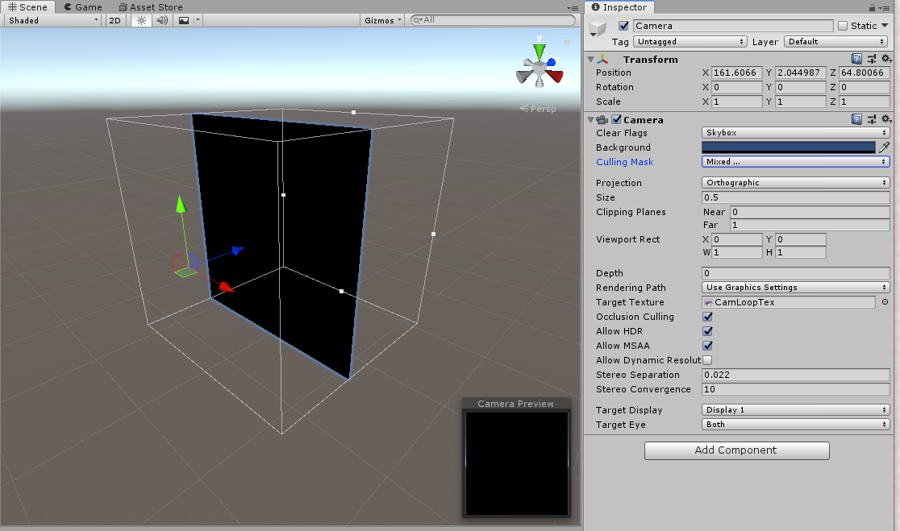
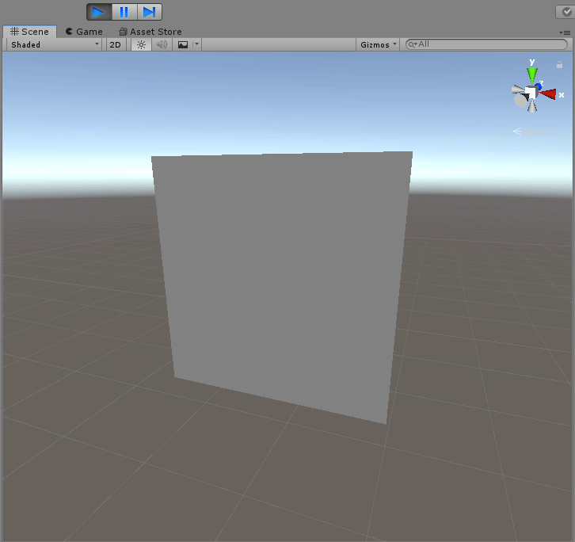
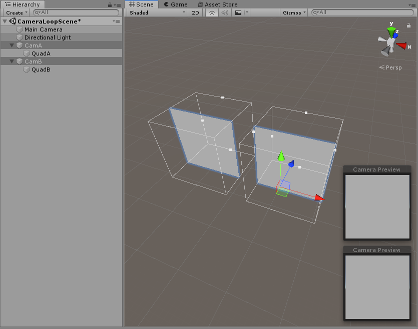

# Camera loops

## What is the purpose
Camera loops are a way of creating stateful shaders. That is, shaders that can store state and base new calculations on this previous state. Useful for GPU particles, fluid simulations, shader-based games etc.

Unlike Custom Render Textures (CRTs), camera loops work well on avatars, but have the caveat of only being visible to friends, regardless of safety settings.

## How to setup a basic camera loop
First, we setup the camera:
- Create a camera (Right click hierarchy > Camera)
- On the inspector, set the cameras 'Projection' setting to 'Orthographic'
- Set the cameras 'Size' setting to 0.5
- Optionally set the cameras 'Near' and 'Far' clipping planes to 0 and 1 respectively
- Create a new RenderTexture (Right click asset view > Create > Render Texture)
- Drag the new RenderTexture into the cameras 'Target Texture' field
- Optionally remove the 'Audio Listener' component from the camera GameObject

Next, we setup of buffer quad:
- Create a new quad (Right click hierarchy > 3D Object > Quad) and parent it to the camera
- Make sure the quad is at position X=0, Y=0 and is inside the cameras view on the Z-axis.
- Create a new shader (Right click asset view > Shader > Unlit Shader)
- Create a new material (Right click asset view > Create > Material) and apply the shader to it
- Assign the RenderTexture you created to the materials 'Texture' field
- Apply the new material to the quad

Lastly, some steps you should take to improve performance:
- Decide on a single Layer for the camera loop (UiMenu is a good choice), set the quad to that Layer
- Set the 'Culling Mask' of the camera to only show that layer

At the end of this, your setup should look roughly like so:


## Making the loop do something
- Open the shader you created previously in an editor
- Change the last line of the frag function from `return col;` to `return frac(col + 0.01);`, this should cause the quad to be colored slightly brighter than it was last frame, every frame, until the color becomes fully white and wraps around. `col` will be the color the quad at the current pixel last frame.
- Enter play mode to see the camera loop in action


In general, you can read any pixel of the the RenderTexture within the shader to get the color at that pixel _last_ frame. Calculations can then be based on these colors.

## Double buffering
Some RenderTexture formats will have issues with the current setup, specifically floating point formats. To demonstrate, change the RenderTextures 'Color Format' to 'ARGB Float'. Notice now that the quad will be a constant shade of gray, and the loop doesn't function. To fix this, I know of 2 methods:

#### Antialiasing - The lazy, bad, but quick to test method
- Set the 'Anti-Aliasing' setting of the RenderTexture to '2 Samples'
- Make sure the 'Depth Buffer' setting is NOT set to 'No depth buffer'

With these settings, the camera loop should function once again. This is a bad solution for a few reasons:
- It increases VRAM usage quite a bit, though this may be negligible if the texture is small
- It breaks directly indexing into the RenderTexture (with integer coordinates)

#### Double buffering - The proper, slightly more tedious method
A more proper solution is 2 use camera loops, where one of them acts like a double buffer.
- Copy the entire camera loop in the scene, move it a bit so the 2 loops don't overlap
- Make a new RenderTexture with the same settings as the first
- Make a new material using a simple unlit shader (not the shader you wrote previously)
- Apply the new RenderTexture to the new material
- Assign the new RenderTexture to the duplicated camera
- Now, to set up the double buffering loop, make sure that the material on each cameras quad reads from the _opposite_ texture of what the camera is writing to.
  
In other words, with 2 cameras CamA and CamB with 2 materials MatA and MatB reading from 2 RenderTextures TexA and TexB, the setup is as follows:

**CamA writes to TexA and looks at a quad with MatA. MatA reads from TexB.**

**CamA writes to TexB and looks at a quad with MatB. MatB reads from TexA.**

Remember that one of these materials (either MatA or MatB) should have a simple unlit textured shader.

The setup looks like so:



## Tips for avatars
One of the main use cases of camera loops are stateful shaders on avatars. When using them for this, there are a couple of caveats to keep in mind:

- Camera components are disabled when the avatar is loaded. To get around this, when using cameras on an avatar, you must use an animation to enable the camera component, and have it disabled during upload.
- Objects attached to your avatar get forced onto the player-related layers (Player, PlayerLocal, MirrorReflection). However, the UiMenu Layer is special and can be used on avatars. It is good practice to put the camera loop quad and the culling mask of the camera to _only_ UiMenu for better performance.
- If you are having issues with parts of the avatar rendering over the camera loop quad, you can set a high render queue on the material and use `ZTest Always` in the shader.
- In order to make the camera loop invisible to players (so they don't see the quad), you can check if `_ProjectionParams.z`, which tells you the max clipping distance of the current camera, matches the settings of the camera you are using for the loop. In practice, this may look like:
```glsl
float4 frag(v2f i) : SV_Target {
    ...
    // don't render for any camera with larger than 2 max clip
    if (_ProjectionParams.z > 2)
        discard;
    ...
}
```

## Other issues and caveats

Some things to keep in mind when using camera loops:
- Cameras are **friends only** regardless of safety settings.
- If you add someone using a camera-utilizing shader, you'll have to rejoin the instance to see it.
- Cloning an avatar using a camera loop causes jankiness because both instances of that avatar will be writing to the same RenderTexture due to them having the same avatar ID. A quick way around this limitation is to just use different uploads of that avatar. You can either distribute a prefab or detach the blueprint ID from the avatar and upload it again.
