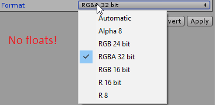
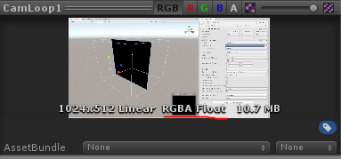

# Reading shader data into udon
**Important:** This page is kept for historical reasons. VRChat now has [a built-in API for reading data from a shader back to Udon](https://creators.vrchat.com/worlds/vrc-graphics/asyncgpureadback). 

This page contains information on how to read pixel data from a RenderTexture (for example one used in a camera loop) into udon.

## What is the purpose
This setup allows for doing expensive calculations on the GPU to utilize its parallel processing capabilities, and then use the results of these calculations to perform tasks in udon.

## How to setup
- First, install Udon and UdonSharp if you haven't already
- Locate the camera that renders to the RenderTexture you are trying to read pixel data from
- Attach a new UdonBehaviour script to the camera GameObject - **Important, the script must be on the camera**

The script should look roughly like so:
```csharp
using UnityEngine;
using UdonSharp;

public class ReadTexture : UdonSharpBehaviour
{
    public Texture2D tex;

    void OnPostRender()
    {
        // Read the pixels.
        tex.ReadPixels(new Rect(0, 0, 256, 256), 0, 0, false);
        tex.Apply();

        // Get the pixels into UDON.
        Color[] pixels = tex.GetPixels(0, 0, 256, 256);

        // ... do something with the pixel data
    }
}
```
Where the 256 is the size of your RenderTexture.

The next step is to create the Texture2D asset to use for reading the pixel data (the `tex` property in the above code):
- I suggest using any image editing software to create a simple PNG with the same dimensions as your RenderTexture
- Import this image into Unity, and assign it to the public `tex` field on the created UdonBehaviour
- Make sure that 'Read/Write Enabled' is checked under the 'Advanced' of the texture import settings
- You might also want to set 'Filter Mode' to 'Point (no filter)'. You can also turn off 'Generate Mip Maps'.


## Floating point formats
The texture format of the imported Texture2D should match the format of your RenderTexture. This becomes an issue when using floating point formats for the RenderTexture, since the formats available from the drop down are quite limited:



Luckily, it is possible to choose other formats than those shown here by manually editing the .meta file of the texture:
- Open the corresponding .meta file for your texture in a text editor (somethinglike MyTextureName.png.meta)
- Find all places in the file that start with `textureFormat:` followed by a number.
- Change this number based on the format of your RenderTexture, you can check what each number corresponds to [at this link](https://github.com/Unity-Technologies/UnityCsReference/blob/61f92bd79ae862c4465d35270f9d1d57befd1761/Runtime/Export/Graphics/GraphicsEnums.cs#L296), for example number 20 means RGBAFloat, which is a 32 bit float on each color channel
- Save the file

Doing this will break the inspector for the texture importer a bit, if you get the following dialogue. Don't press either 'Apply' or 'Revert'. Instead, just press the red X at the top right to close the dialogue.


You can check if your changes worked by looking at the preview at the bottom of the texture inspector:



## Note about performance
This setup causes quite a bit of CPU overhead, and you should only really use it if you have a valid reason for reading data out of a shader. We are getting `Graphics.Blit` for worlds at some point, which could invalidate this setup. Currently, there aren't other ways of reading data out of a shader.

For an example of a map using the technique, check [my raymarched collision world](https://vrchat.com/home/launch?worldId=wrld_7cf3b5f3-fc4f-4213-88c6-289d699cadba) which calculates collision in a shader, reads this data into Udon, and uses Udon to place colliders.
