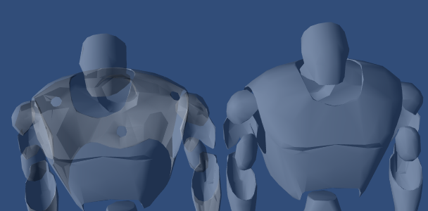
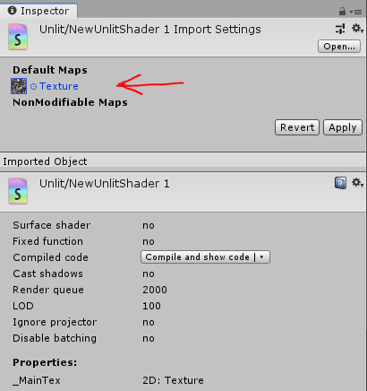

# Tips and tricks
A document for various small tips and tricks I've picked up that don't warrant their own full pages.

### Point light position abuse
Many people use point lights to get the positions of arbitrary objects in shaders. To do this, first set `LightMode` of your shader to a setting that will allow for sampling lights:

```glsl
Tags { "LightMode"="FowardBase" }
...
```

Then, in the shader, you can use this code to get the world space position of the `i`'th point light (`i` can be from 0-3).
```glsl
float3 light_pos = float3(unity_4LightPosX0[i], unity_4LightPosY0[i], unity_4LightPosZ0[i]);
```

To prevent annoyance, most people set the color of their point lights to fully back (0, 0, 0) and use the alpha value to distinguish between point lights. You can get the alpha value of the `i`'th light as so:

```glsl
unity_LightColor[i].a
```

It is important to set the 'Render Mode' of the point light to 'Not Important' to force the light to be a vertex light.

If possible, you should also put the lights 'Culling Mask' to only 'UiMenu' and put whatever you want to interact with the light on that same layer. That way, you don't add passes to everybodies avatar, causing lag. The UiMenu layer, unlike most other layers, is usable even on avatars.

The `unity_4LightPos` arrays will contain positions of vertex lights, but may also contain positions of pixel lights (Render Mode = Important or Auto) if the shader doesn't contain an add pass. To prevent these arrays from being polluted with random pixel lights, you can add an additional pass to the shader with the tag `Tags { "LightMode"="ForwardAdd" }`, which does nothing:
```glsl
... main pass goes above here

Pass
{
    Tags { "LightMode"="ForwardAdd" }
    CGPROGRAM
    #pragma vertex empty
    #pragma fragment empty
    void empty(){}
    ENDCG
}
```

### Exporting textures with GrabPass
Textures from named GrabPasses will be available globally in any shader, ie:

```glsl
GrabPass { "_MyGlobalTexture" }
```

Then any shader can access it by just declaring a field:
```glsl
...
sampler2D _MyGlobalTexture;
...
```
[This is what AudioLink uses to make a data texture available to avatars](https://github.com/llealloo/vrc-udon-audio-link/blob/master/AudioLink/Shaders/AudioTextureExport.shader)


### Cheap wireframe abusing MSAA
Courtesy of d4rkpl4y3r.
```glsl
float4 frag (centroid float4 p : SV_POSITION) : SV_Target
{
    return any(frac(p).xy != 0.5);
}
```

### Avoiding draw order issues with transparent shaders
You can add a pass in front of the main pass for a transparent shader which just fills the depth buffer as such:
```glsl
Pass
{
    ZWrite On
    ColorMask 0
}
```
Comparison without and with this pass



### Checking if a texture exists
You can check for existance (if it has been set) of a texture as such:
```glsl
Texture2D _MyTexture;

bool TextureExists()
{
    int width, height;
    _MyTexture.GetDimensions(width, height);
    return width > 16;
}
```
This is especially useful when accessing globally exported GrabPass textures. Keep in mind the texture must be declared as `Texture2D`, not `sampler2D`.
Thanks to ACIIL for finding this originally.

To make use of this in a surface shader, you should wrap the code in a `SHADER_TARGET_SURFACE_ANALYSIS` guard:
```glsl
#ifndef SHADER_TARGET_SURFACE_ANALYSIS
// call Texture2D.GetDimensions here
#endif
```

### GLSL modulo operator
Use this instead of HLSL's piece of shit `fmod`. It behaves better on negative numbers.
```glsl
#define glsl_mod(x,y) (((x)-(y)*floor((x)/(y))))
```

### Check if shader is being rendered in mirror
```glsl
bool isInMirror()
{
    return unity_CameraProjection[2][0] != 0.f || unity_CameraProjection[2][1] != 0.f;
}
```

### Some tricks with shader properties
You can make an integer slider property using the IntRange attribute such:

```glsl
Properties {
    [IntRange] _MyIntSlider ("My Int Slider", Range(0, 10)) = 0
}
```

Properties can be used to control shader settings such as culling, blend modes, depth buffer writing, etc. Example:

```glsl
Properties
{
    [Enum(UnityEngine.Rendering.CullMode)] _Cull ("Cull", Float) = 0
    [ToggleUI] _ZWrite ("ZWrite", Float) = 0
}
SubShader
{
    Cull [_Cull]
    ZWrite [_ZWrite]
}
```

**Always** make sure to use the `[ToggleUI]` attribute for checkboxes. Never use `[Toggle]` as it implicitly creates a keyword.

You can also create enum dropdown properties manually as such:
```glsl
Properties {
    [Enum(One,1,SrcAlpha,5)] _Blend2 ("Blend mode subset", Float) = 1
}
```
The values are pairs of (dropdown name, dropdown value).

### Applying default texture to shader
If you open the inspector for a **shader** (not a specific material), you can drag default values for textures on to each texture property. Any material created from the shader will inherit this texture as the default.



### Functions for detecting VRChat specific scenarios
Courtesy of ScruffyRuffles and Merlin.
```glsl
bool isVR() {
    #if UNITY_SINGLE_PASS_STEREO
        return true;
    #else
        return false;
    #endif
}

bool isVRHandCamera() {
    return !isVR() && abs(UNITY_MATRIX_V[0].y) > 0.0000005;
}

bool isDesktop() {
    return !isVR() && abs(UNITY_MATRIX_V[0].y) < 0.0000005;
}

bool isVRHandCameraPreview() {
    return isVRHandCamera() && _ScreenParams.y == 720;
}

bool isVRHandCameraPicture() {
    return isVRHandCamera() && _ScreenParams.y == 1080;
}

bool isPanorama() {
    return unity_CameraProjection[1][1] == 1 && _ScreenParams.x == 1075 && _ScreenParams.y == 1025;
}

bool isInMirror()
{
    return unity_CameraProjection[2][0] != 0.f || unity_CameraProjection[2][1] != 0.f;
}
```

### Inline sampler states
Sometimes you want to control the settings used for sampling a texture you don't have access to the importer for, like a texture exported from a GrabPass. In such cases, you can use inline sampler states ([https://docs.unity3d.com/Manual/SL-SamplerStates.html](https://docs.unity3d.com/Manual/SL-SamplerStates.html)). The idea is to include certain keywords in the name of your `SamplerState` declaration:

```glsl
Texture2D _MainTex;
SamplerState my_point_clamp_sampler;
// ...
half4 color = _MainTex.Sample(my_point_clamp_sampler, uv);
```
Notice the name 'my_point_clamp_sampler'. The following case insensitive keywords apply:
| Keyword    | Meaning                                   |
|------------|-------------------------------------------|
| Point      | Point (nearest neighbor) filtering.       |
| Linear     | Bilinear filtering.                       |
| Trilinear  | Trilinear filtering.                      |
| Clamp      | Clamp when reading outside of [0;1]       |
| Repeat     | Repeat when reading outside of [0;1]      |
| Mirror     | Mirror when reading outside of [0;1]      |
| MirrorOnce | Mirror Once when reading outside of [0;1] |
| Compare    | Set up sampler for depth comparison       |

### Shader fallbacks
When someone doesn't show the shaders on your avatar via safety settings, a fairly non-trivial system decides which built in shader to use instead. The only explanation for the logic this system uses is described here:
[https://pastebin.com/92gwQqCM](https://pastebin.com/92gwQqCM).

Thanks to Red_Mage for sharing.

### Update When Offscreen setting for Skinned Mesh Renderer
The "Update When Offscreen" setting on Skinned Mesh Renderers has special behavior in VRChat.

For the local avatar, this setting is forced **on**.

For all remote avatars, this setting is forced **off**.

Both of these behaviors happen regardless of the settings you have chosen. This can cause culling issues when part of a Skinned Mesh Renderer is outside of its minimal bounding box (for example when creating geometry with a geometry shader), and may lead to issues where remote players can see the geometry, but the local player cannot.

Thank you Lox for enlightening me with this arcane knowledge.

### Usable default values for shader texture properties
When declaring a texture property in a shader, you can set a default value for it:
```txt
_MainTex ("My Texture", 2D) = "white"{}
```
Most people know of values such as "white" and "black", but there are quite a few other undocumented ones. Here is a list of some values you can use:
```glsl
red
gray
grey
linearGray
linearGrey
grayscaleRamp
greyscaleRamp
bump
blackCube
lightmap
unity_Lightmap
unity_LightmapInd
unity_ShadowMask
unity_DynamicLightmap
unity_DynamicDirectionality
unity_DynamicNormal
unity_DitherMask
_DitherMaskLOD
_DitherMaskLOD2D
unity_RandomRotation16
unity_NHxRoughness
unity_SpecCube0
unity_SpecCube1
```
This is useful for scenarios where you want users to be able to set an override for, for example, lightmaps or reflection probes:
```txt
_LightmapOverride ("Lightmap", 2D) = "unity_Lightmap"{}
_ReflectionProbeOverride ("Reflection", CUBE) = "unity_SpecCube0"{}
```